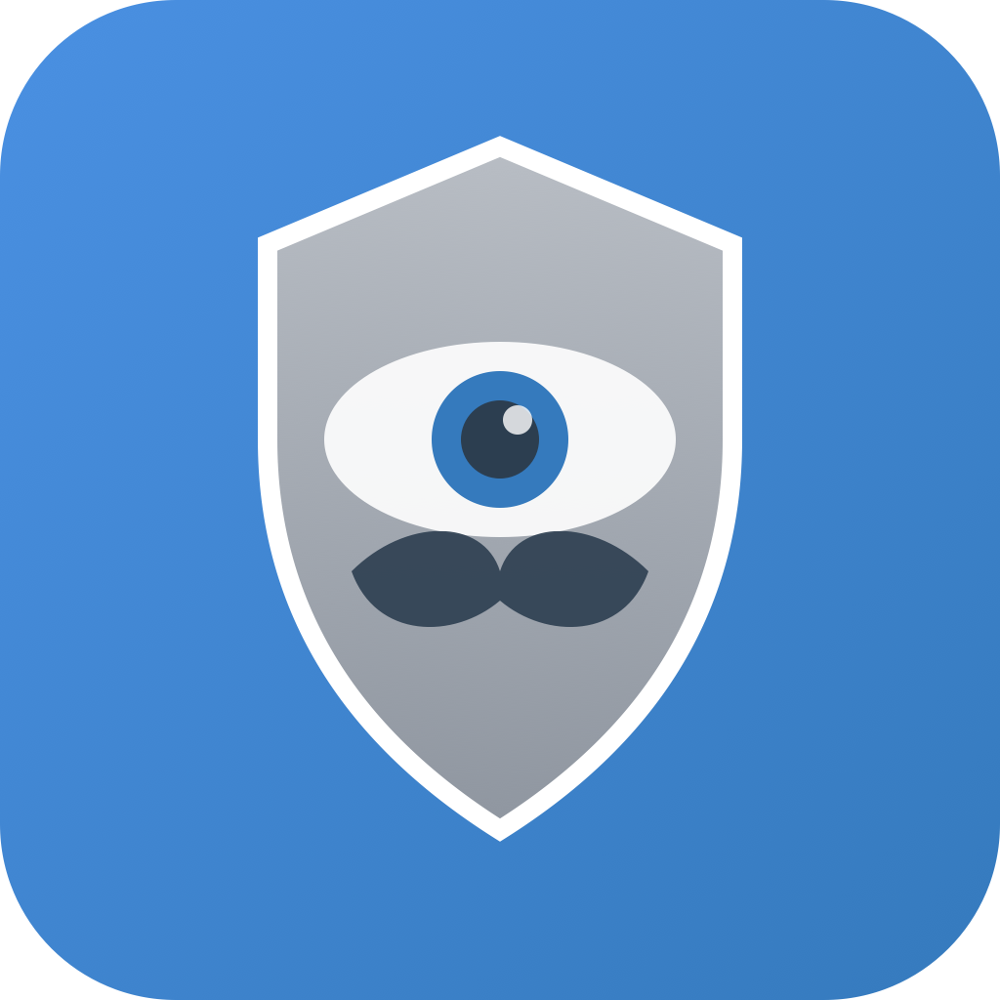
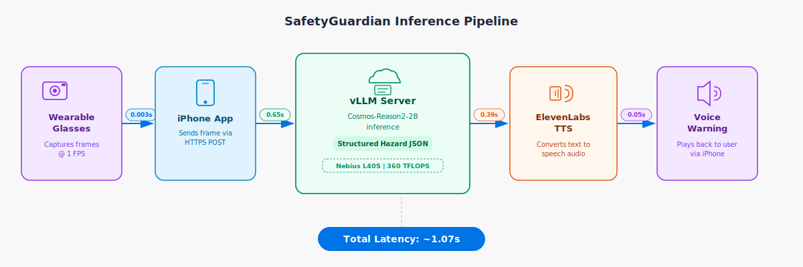
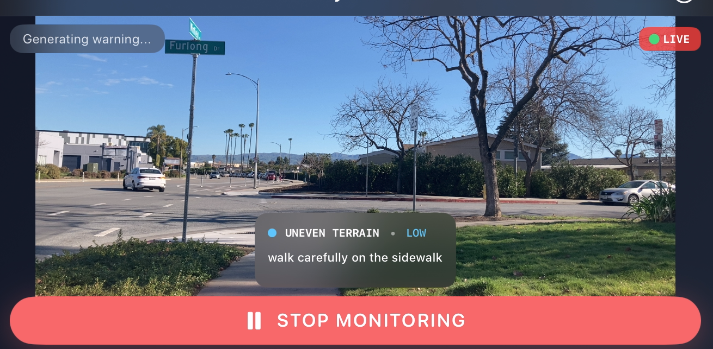
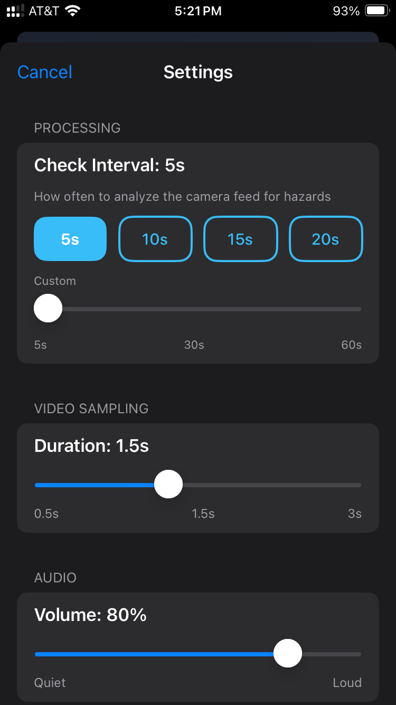

# SafetyGuardian



AI-powered hazard detection iOS app for elderly safety using camera vision and audio warnings.

**Team:** The Yeungs — Winnie Yeung & Eyan Yeung

**Competition:** [NVIDIA Cosmos Cookoff](https://github.com/orgs/nvidia-cosmos/discussions/4)

**Blog:** [vionwinnie.github.io/safetyguardian](https://vionwinnie.github.io/safetyguardian/)

**Platform:** iOS 16.0+ | **AI Model:** Cosmos-Reason2-2B (fine-tuned with LoRA) | **TTS:** ElevenLabs Turbo v2.5

---

## Overview

SafetyGuardian is an iOS app that continuously monitors the path ahead for hazards and delivers spoken warnings in real time. It is designed with wearable glasses as the intended form factor — currently running on iPhone, with USB camera support for external lens mounting. It uses a custom fine-tuned version of NVIDIA's Cosmos-Reason2-2B vision-language model, trained on 264 labeled first-person hazard scenarios across 11 categories.

The model was fine-tuned using synthetic video data generated by NVIDIA Cosmos-Predict2.5, human-reviewed and labeled, then trained via QLoRA SFT on an H100 GPU. The fine-tuned adapter is served via vLLM on a Nebius GPU instance and queried by the iOS app over a secured API.

## How It Works



```
Wearable Camera / iPhone Camera
    | AVFoundation (1080p, samples 6 frames over 1.5s)
    v
CosmosAPI --> vLLM + Cosmos-Reason2-2B + LoRA adapter
    | Structured output: "HAZARD: ice | SEVERITY: high | ACTION: slow down"
    v
HazardDetection parser --> Natural speech conversion
    | "Caution! Ice ahead. Slow down."
    v
ElevenLabs TTS --> Spoken audio warning
```

The cycle repeats every 20 seconds (configurable 5-60s in-app).

## Features

- Real-time camera capture and hazard detection
- AI-powered vision analysis using fine-tuned Cosmos-Reason2-2B with LoRA
- Structured hazard output with severity-based color coding (green/blue/yellow/orange/red)
- Natural voice warnings via ElevenLabs TTS
- Configurable processing intervals (5-60s) and video sample duration
- Support for external USB cameras (wearable glasses)
- Background audio playback with audio ducking
- Server health monitoring
- Portrait and landscape layouts

## Demo

### App Screenshots

 


## Quick Start

### Prerequisites

- **iOS app**: Xcode 15+, iPhone running iOS 16.0+
- **Inference server**: NVIDIA GPU (tested on L40S), CUDA 12.8+, [uv](https://docs.astral.sh/uv/getting-started/installation/)
- **Accounts**: [ElevenLabs](https://elevenlabs.io) API key for TTS

### 1. Start the Inference Server

On your GPU instance:

```bash
cd server/
cp .env.example .env
# Edit .env: set VLLM_API_KEY, MODEL_WEIGHTS_PATH, MEDIA_PATH
./serve_finetuned_model.sh
```

See [`server/VLLM_SETUP.md`](server/VLLM_SETUP.md) for full setup details including model weights and LoRA configuration.

### 2. Configure the iOS App

```bash
cp app/Config.plist.template app/Config.plist
```

Edit `app/Config.plist`:

| Key | Value |
|-----|-------|
| `VLLM_SERVER_URL` | `http://YOUR_SERVER_IP:8000/v1` |
| `VLLM_API_KEY` | Must match `VLLM_API_KEY` in server `.env` |
| `ELEVENLABS_API_KEY` | Your ElevenLabs API key |

### 3. Build and Run

```bash
open app/SafetyGuardian.xcodeproj
# Build and run on device: Cmd+R
```

## Project Structure

```
SafetyGuardian/
├── app/                              # iOS application
│   ├── SafetyGuardian.xcodeproj
│   ├── Sources/SafetyGuardian/
│   │   ├── SafetyGuardianApp.swift   # App entry point
│   │   ├── ContentView.swift         # Main UI, settings, theme
│   │   ├── Configuration.swift       # Config loading, UserDefaults
│   │   ├── Models.swift              # Data models, hazard parser
│   │   ├── CameraManager.swift       # AVFoundation capture + orientation
│   │   ├── CosmosAPI.swift           # vLLM client with retry + auth
│   │   ├── TTSManager.swift          # ElevenLabs TTS
│   │   └── AudioPlayer.swift         # Audio queue + ducking
│   ├── Tests/SafetyGuardianTests/    # Unit + integration tests
│   ├── Assets.xcassets/              # App icons
│   ├── Config.plist.template         # Configuration template (copy → Config.plist)
│   └── Info.plist
│
├── server/                           # vLLM inference server
│   ├── serve_finetuned_model.sh      # Server startup script
│   ├── pyproject.toml                # Python dependencies (uv)
│   ├── .env.example                  # Environment variable template
│   └── VLLM_SETUP.md                 # Detailed setup guide
│
├── training/                         # Model fine-tuning
│   ├── trl_sft_safety_guardian.py    # QLoRA SFT training script
│   ├── finetune_instructions.md      # Fine-tuning guidelines
│   └── TRAINING_PIPELINE.md          # End-to-end pipeline documentation
│
├── data-curation/                    # Training data pipeline
│   ├── frame_analyzer.py             # Batch frame analysis
│   ├── training_data.jsonl           # 264 labeled training samples
│   ├── sync-cosmos-videos.sh         # Sync videos from GPU server
│   ├── analysis_queue.json           # Frame analysis job queue
│   ├── comments.json                 # Human reviewer ratings
│   ├── review_log.md                 # Structured review decisions
│   └── cosmos-generated-videos/      # Synthetic videos (gitignored)
│
├── sample-data/                      # 5 demo video + JSON pairs
│   ├── 00B8_ice_patch.*              # Black ice
│   ├── 03B1_cone_warning.*           # Construction cone
│   ├── 3A7A_puddle_deep.*            # Deep puddle
│   ├── 4D74_cyclist_fast.*           # Fast approaching cyclist
│   └── E900_clear_open.*             # Clear path (negative example)
│
└── README.md
```

## Training Pipeline

The model is fine-tuned using a custom data pipeline:

1. **Video Generation** — 106 synthetic first-person scenarios generated with NVIDIA Cosmos-Predict2.5-2B across 11 hazard categories
2. **Human Review** — Videos rated and filtered (106 -> 66 usable scenarios)
3. **Frame Extraction** — 5 frames per video at regular intervals
4. **Labeling** — Structured `HAZARD | SEVERITY | ACTION` format
5. **Training** — QLoRA SFT with TRL on a single H100 GPU
   - LoRA rank 64, lr=4.4e-04, batch=16, 20 epochs
   - Final dataset: 264 samples (237 train / 27 val)

See [`training/TRAINING_PIPELINE.md`](training/TRAINING_PIPELINE.md) for full details.

### Hazard Categories

| Category | Severity Range | Examples |
|----------|---------------|----------|
| clear | none | Open, safe path |
| wet surface | low → critical | Rain-slicked sidewalk |
| pedestrian | low → critical | Person in walking path |
| obstacle | medium → high | Construction cone, debris |
| vehicle | medium → critical | Approaching car |
| ice | medium → critical | Black ice, frozen patch |
| puddle | medium → critical | Deep water on path |
| narrow path | low → high | Tight corridor |
| animal | low → high | Dog, bird in path |
| uneven terrain | medium → high | Cracked sidewalk, roots |
| flood | high → critical | Flooded walkway |

## Security

- `app/Config.plist` is gitignored — never commit it
- `server/.env` is gitignored — never commit it
- vLLM endpoint requires Bearer token authentication (`VLLM_API_KEY`)
- `data-curation/cosmos-generated-videos/` is gitignored (large generated data)

## Running Tests

```bash
./app/run_tests.sh
```

## License

NVIDIA Cosmos Cookoff 2026 project

---

Made with ❤️ for elderly safety
